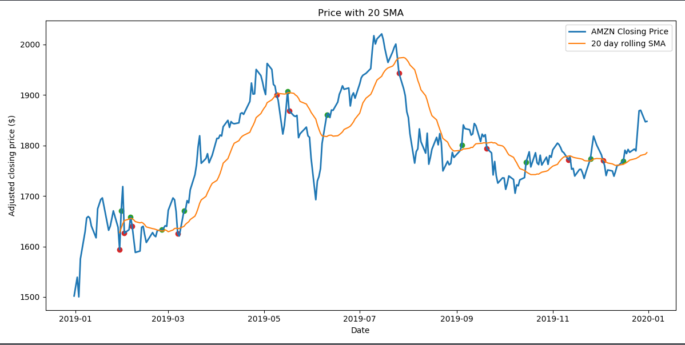

# Algorithmic Trading Bot in Python

Welcome to the Algoritmic Trading Bot Project! 
The goal of this project is to develop an automated trading bot that uses trading strategies in order to maximaze the starting buy-in budget.

The image above is an example of the first offline trading period of the bot. It illustrates BUY and SELL actions that our algo-trading bot executed. The blue line is the stock of the AMAZON from January of 2019 until August of 2020. 
Marked with GREEN are the BUY-IN Points that the Bot bought stocks and with RED are marked the SELL Points that the Bot sold its owned stocks.

The result of this mock-trading version was an 12% increase of the original budget.
